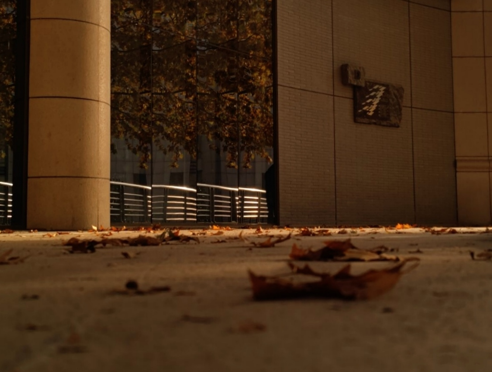

## 雪之霜
***台阶漆满白色***

***皲裂的风扫过***

***脾胃在呐喊中***

***心象参差错落***

### - Whose Poems?


* 🈶[{{ post.title }}](./{{ post.url }}) -{{ post.data }}
  
  

### - Poems


* 🈚[{{ post.title }}](./{{ post.url }}) -{{ post.data }}



----------

## 2023's winter [{{ ABOUT }}](./{{ about.url }})

> 调色过于饱和的秋
>
> 打印在主楼的玻璃上
